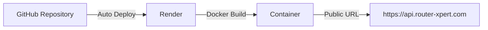
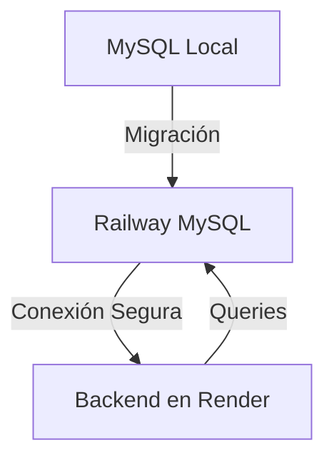

<div align="center">

# 🚚 Router-Xpert

### Plataforma Inteligente de Gestión Logística

[](https://nodejs.org/)
[](https://www.typescriptlang.org/)
[](https://nestjs.com/)
[](https://www.prisma.io/)
[](https://www.mysql.com/)

<p align="center">
  
  
  
</p>

---

</div>

## 📋 Tabla de Contenidos

- [Sobre el Proyecto](#-sobre-el-proyecto)
- [Características](#-características)
- [Comenzando](#-comenzando)
- [Pre-requisitos](#-pre-requisitos)
- [Instalación](#-instalación)
- [Uso](#-uso)
- [Pruebas](#-pruebas)
- [Despliegue](#-despliegue)
- [Tecnologías](#️-tecnologías)
- [Autores](#️-autores)
- [Contacto](#-contacto)

---

## 🎯 Sobre el Proyecto

**Router Manager** es una plataforma web integral diseñada para revolucionar la gestión logística. Nuestra solución permite a las empresas de paquetería optimizar sus operaciones mediante:

- 📍 **Seguimiento GPS en tiempo real**
- 🗺️ **Gestión inteligente de rutas**
- 📦 **Control centralizado de paquetes**
- 📊 **Monitoreo logístico avanzado**
- ⚡ **Optimización de tiempos de entrega**

> 💡 **Desarrollado con y para conductores:** Cada funcionalidad ha sido diseñada basándose en las necesidades reales identificadas por profesionales del sector logístico.

---

## ✨ Características

<table>
<tr>
<td width="50%">

### 👨‍💼 Para Administradores
- ✅ Gestión completa de rutas
- ✅ Creación y asignación de paquetes
- ✅ Control de flotas y conductores
- ✅ Reportes y analíticas en tiempo real
- ✅ Dashboard administrativo intuitivo

</td>
<td width="50%">

### 🚗 Para Conductores
- ✅ Visualización de rutas asignadas
- ✅ Registro de novedades en campo
- ✅ Seguimiento GPS integrado
- ✅ Actualización de estados de entrega
- ✅ Interfaz móvil optimizada

</td>
</tr>
</table>

---

## 🚀 Comenzando

### 1️⃣ Clonar el repositorio

```bash
# Clonar el proyecto
git clone https://github.com/tu-usuario/router-manager-backend.git

# Navegar al directorio
cd router-manager-backend
```

### 2️⃣ Configurar variables de entorno

```bash
# Crear archivo .env
cp .env.example .env

# Editar con tus credenciales
nano .env
```

---

## 📦 Pre-requisitos

Asegúrate de tener instalado lo siguiente en tu sistema:

| Herramienta | Versión Mínima | Descarga |
|------------|----------------|----------|
|  | 18.x o superior | [Descargar](https://nodejs.org/) |
|  | 8.0 o superior | [Descargar](https://www.mysql.com/) |
|  | Última versión | [Descargar](https://git-scm.com/) |
|  | 1.22 o superior | [Descargar](https://yarnpkg.com/) |

---

## 🔧 Instalación

### Paso 1: Instalar dependencias

```bash
yarn install
```

<details>
<summary>💡 ¿Qué hace este comando?</summary>

Este comando descarga e instala todas las dependencias necesarias definidas en `package.json`, incluyendo:
- Frameworks (NestJS)
- ORMs (Prisma)
- Librerías de utilidad
- Herramientas de desarrollo

</details>

### Paso 2: Configurar base de datos

```bash
# Generar cliente de Prisma
yarn prisma generate

# Ejecutar migraciones
yarn prisma migrate deploy

# (Opcional) Sembrar datos iniciales
yarn prisma db seed
```

### Paso 3: Iniciar servidor de desarrollo

```bash
yarn start:dev
```

<div align="center">

### 🎉 ¡Listo! Tu servidor está corriendo en `http://localhost:8080`

</div>

---

## 💻 Uso

### Comandos disponibles

```bash
# Desarrollo
yarn start:dev          # Inicia el servidor en modo desarrollo
yarn start:debug        # Inicia con debugger activo

# Producción
yarn build              # Compila el proyecto
yarn start:prod         # Inicia el servidor en producción

# Base de datos
yarn prisma studio      # Abre interfaz visual de la BD
yarn prisma migrate dev # Crea nueva migración

# Pruebas
yarn test               # Ejecuta pruebas unitarias
yarn test:e2e          # Ejecuta pruebas end-to-end
yarn test:cov          # Genera reporte de cobertura

# Linting
yarn lint              # Verifica estilo de código
yarn format            # Formatea archivos
```

## 📦 Despliegue

### 🌐 Backend - Render

<div align="center">



</div>

**Proceso de despliegue:**

1. **Push a GitHub:** El código se sube al repositorio
2. **Detección automática:** Render detecta el `Dockerfile`
3. **Build:** Se construye la imagen Docker
4. **Deploy:** Se despliega automáticamente
5. **Health Check:** Render verifica que la app esté funcionando

> ⚠️ **Nota importante:** Si el despliegue falla, revisa los logs en el dashboard de Render para identificar errores.

### 🗄️ Base de Datos - Railway

<div align="center">



</div>

**Características:**

- ✅ Alta disponibilidad 99.9%
- ✅ Backups automáticos diarios
- ✅ Conexión SSL/TLS
- ✅ Escalamiento automático


## 🛠️ Tecnologías

<div align="center">

### Stack Principal

<table>
<tr>
<td align="center" width="25%">

<br><strong>TypeScript</strong>
<br><sub>Lenguaje tipado</sub>
</td>
<td align="center" width="25%">

<br><strong>NestJS</strong>
<br><sub>Framework backend</sub>
</td>
<td align="center" width="25%">

<br><strong>Prisma</strong>
<br><sub>ORM moderno</sub>
</td>
<td align="center" width="25%">

<br><strong>MySQL</strong>
<br><sub>Base de datos</sub>
</td>
</tr>
</table>

### Herramientas y Servicios

| Categoría | Tecnología | Propósito |
|-----------|------------|-----------|
| 🔐 **Autenticación** | Firebase Auth | Gestión de usuarios y sesiones |
| 📦 **ORM** | Prisma | Mapeo objeto-relacional |
| 🚀 **Deploy Backend** | Render | Hosting del servidor |
| 🗄️ **Deploy BD** | Railway | Hosting de base de datos |
| 🔄 **Versionado** | Git & GitHub | Control de versiones |
| 📝 **Linting** | ESLint | Análisis de código |
| 💅 **Formato** | Prettier | Formateo automático |
| 🧪 **Testing** | Jest | Framework de pruebas |

</div>

---

## ✒️ Autores

<div align="center">

<table>
<tr>
<td align="center">
<a href="https://github.com/juancapera26">
<br>
<sub><b>Juan Capera</b></sub>
</a><br>
<sub>Full Stack Developer</sub><br>
<a href="https://github.com/juancapera">💻</a>

</td>
<td align="center">
<a href="https://github.com/master2x">
<br>
<sub><b>Jair Duarte</b></sub>
</a><br>
<sub>Full Stack Developer</sub><br>
<a href="https://github.com/jairduarte">💻</a>

</td>
<td align="center">
<a href="https://github.com/LEONARDOSQL-hub">
<br>
<sub><b>Jose Becerra</b></sub>
</a><br>
<sub>Full Stack Developer</sub><br>
<a href="https://github.com/josebecerra">💻</a>
</td>
</tr>
</table>

</div>
</div>
